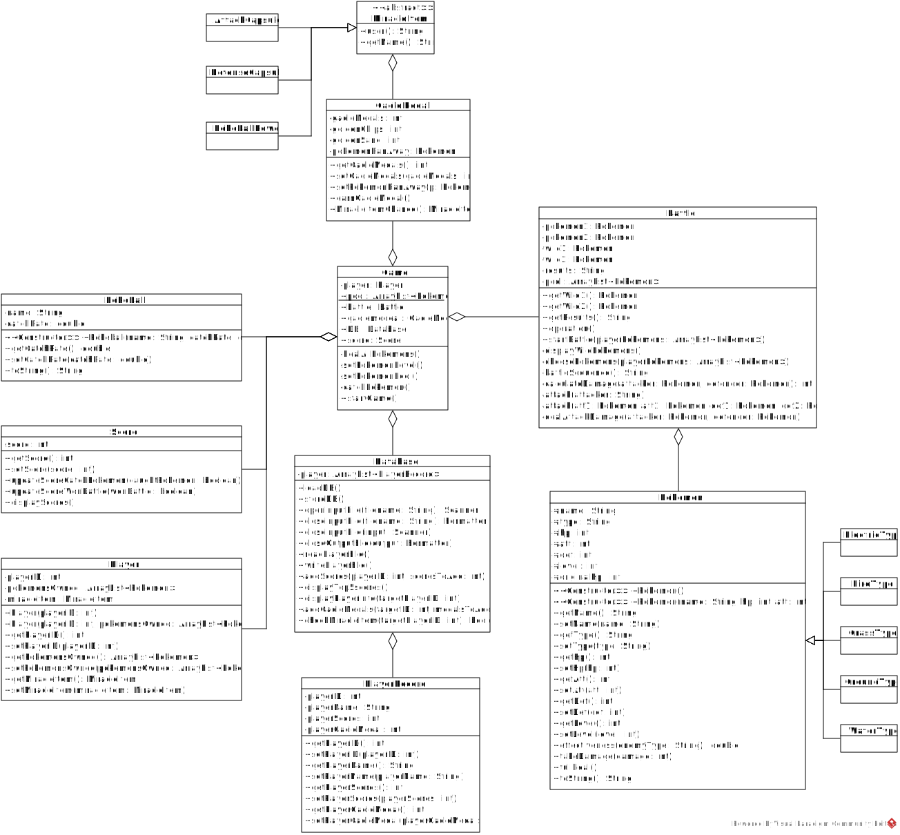

# Pokémon Ga-Olé Game
This project is a Java Console Application that recreates the Pokémon Ga-Olé arcade game using Object-Oriented Programming (OOP) principles. It models key gameplay elements such as battles, Pokéballs, Pokémon entities, and Ga-Olé Medals, all encapsulated within distinct classes. The project emphasizes modularity and scalability, ensuring that each component is maintainable and interacts seamlessly with others.

[Demonstration Video](https://youtu.be/QEQFi2ZosaA)

## Getting Started

### Prerequisites
🕹️ Java Development Kit (JDK) - Version 17 or later

### Setup
1. Clone the repository.

	```sh
	git clone https://github.com/kahgin/pokemon-gaole.git
	```

2. Run the application.

	```sh
	# For Windows
	run.bat
	
	# For macOS/Linux
	./run.sh
	```

## UML Class Diagram


## Contributors
🕹️ Chan Kah Gin

🕹️ Ho Zi Shan

🕹️ Ilyana Sofiya Binti Muhammad Najeli

🕹️ Lee Wen Xuan

🕹️ Melvern Lim Jian Xin
